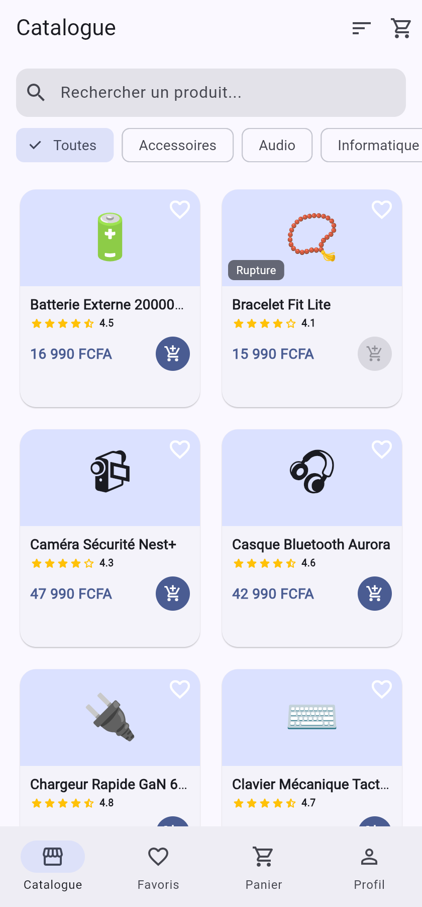
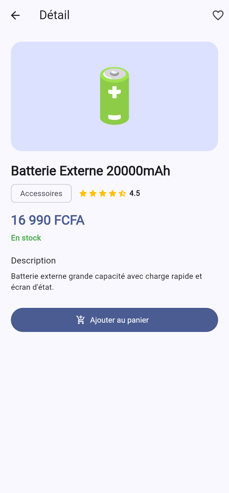
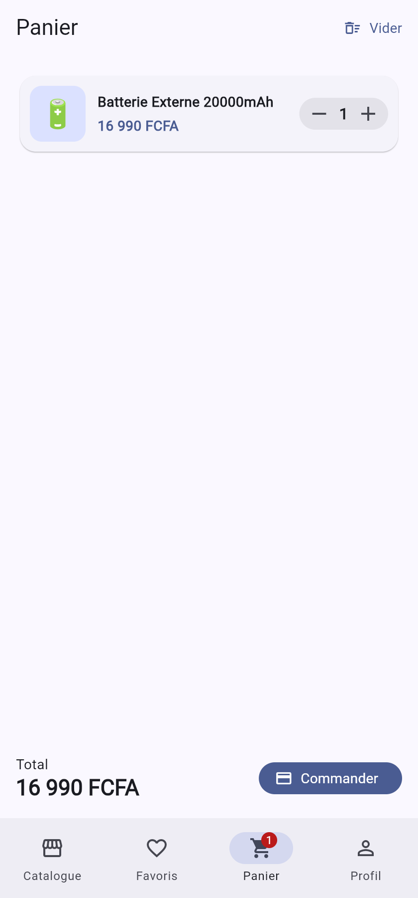
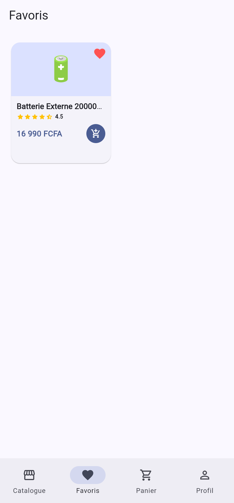
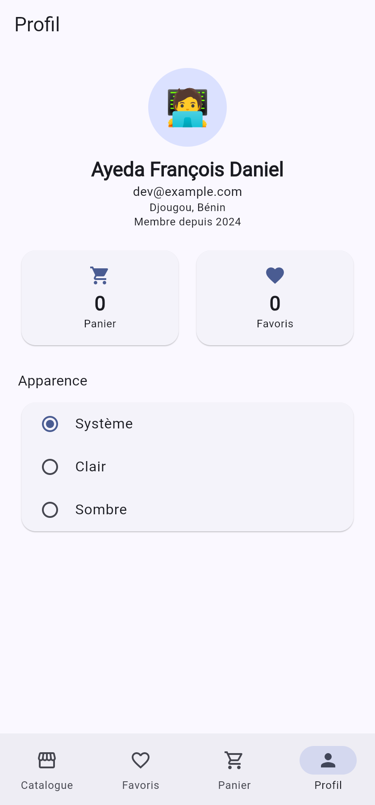
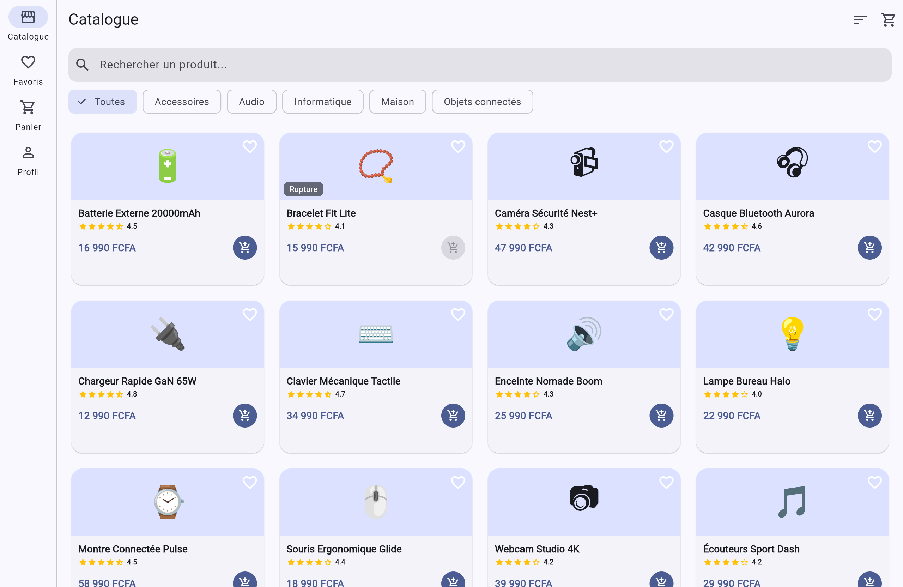

# Shop Riverpod

Petite application e-commerce faite avec Flutter et **Riverpod** pour
apprendre le state management. On peut parcourir un catalogue de
produits, ouvrir le détail d'un produit, gérer un panier, mettre des
produits en favoris (sauvegardés sur le téléphone), filtrer/trier, et
voir un écran de profil.

Les produits sont des données de test (fichier JSON local) chargées de
façon asynchrone, et j'utilise `AsyncValue` pour afficher le chargement
et les erreurs.

## Fonctionnalités

- Catalogue : liste des produits + recherche + filtre par catégorie + tri
- Détail d'un produit
- Panier : ajouter, changer la quantité (+/−), supprimer, total
- Favoris sauvegardés localement (`shared_preferences`)
- Écran de profil (données mock) + choix du thème clair/sombre
- Gestion du chargement et des erreurs (spinner / message + « Réessayer »)
- Bonus : petite animation du badge du panier quand on ajoute un produit

## Organisation du projet

J'ai essayé de séparer le code : les données d'un côté, les providers
(la logique) au milieu, et les écrans/widgets qui affichent. Les écrans
ne touchent jamais directement au JSON ou à shared_preferences, ils
passent par les providers.

```
lib/
├── main.dart            # ProviderScope + MaterialApp
├── theme.dart           # thème clair / sombre
├── models/              # les classes de données (Product, CartItem, UserProfile)
├── data/                # product_repository.dart : lit assets/products.json
├── providers/           # tous les providers Riverpod
├── screens/             # les écrans (catalogue, détail, panier, favoris, profil)
├── widgets/             # widgets réutilisés (carte produit, étoiles, etc.)
└── utils/               # format.dart : afficher les prix en FCFA
assets/
└── products.json        # 12 produits de test
```

## Les providers

| Provider | Type | À quoi il sert |
|---|---|---|
| `productRepositoryProvider` | `Provider` | Donne accès au repository (pratique pour les tests) |
| `catalogProvider` | `FutureProvider` | Charge les produits → `AsyncValue` |
| `productByIdProvider` | `FutureProvider.family` | Charge un produit par son id (écran détail) |
| `searchQueryProvider` | `StateProvider` | Le texte de recherche |
| `categoryFilterProvider` | `StateProvider` | La catégorie choisie |
| `sortOptionProvider` | `StateProvider` | Le tri choisi |
| `cartProvider` | `NotifierProvider` | Le panier (ajout/quantité/suppression) |
| `favoritesProvider` | `NotifierProvider` | Les favoris (sauvegardés) |
| `profileProvider` | `FutureProvider` | Le profil utilisateur (mock) |
| `themeModeProvider` | `StateProvider` | Le thème clair/sombre |

Il y a aussi quelques providers calculés à partir des autres :
`filteredProductsProvider` (catalogue une fois filtré et trié),
`categoriesProvider`, `cartCountProvider`, `cartTotalProvider` et
`isFavoriteProvider`.

Pour le panier et les favoris j'ai utilisé `Notifier` / `NotifierProvider`
(Riverpod 2.x, comme dans le cours) parce qu'il y a de la logique
(ajouter, incrémenter, sauvegarder). Pour les choses plus simples
(recherche, tri, thème) un `StateProvider` suffit.

### AsyncValue

Le catalogue, le détail et le profil renvoient un `AsyncValue`. Pour ne
pas répéter le même code partout, j'ai fait un petit widget
`AsyncValueWidget` qui gère les 3 cas (`loading` → spinner, `error` →
message + bouton « Réessayer », `data` → l'écran).

## Lancer le projet

```bash
flutter pub get
flutter run            # sur un téléphone / émulateur
flutter run -d chrome  # dans le navigateur
```

Lancer les tests :

```bash
flutter test
```

## Captures d'écran

| Catalogue | Détail | Panier |
|---|---|---|
|  |  |  |

| Favoris | Profil | Version large (tablette/desktop) |
|---|---|---|
|  |  |  |

## Packages utilisés

- `flutter_riverpod` — le state management
- `shared_preferences` — pour sauvegarder les favoris
